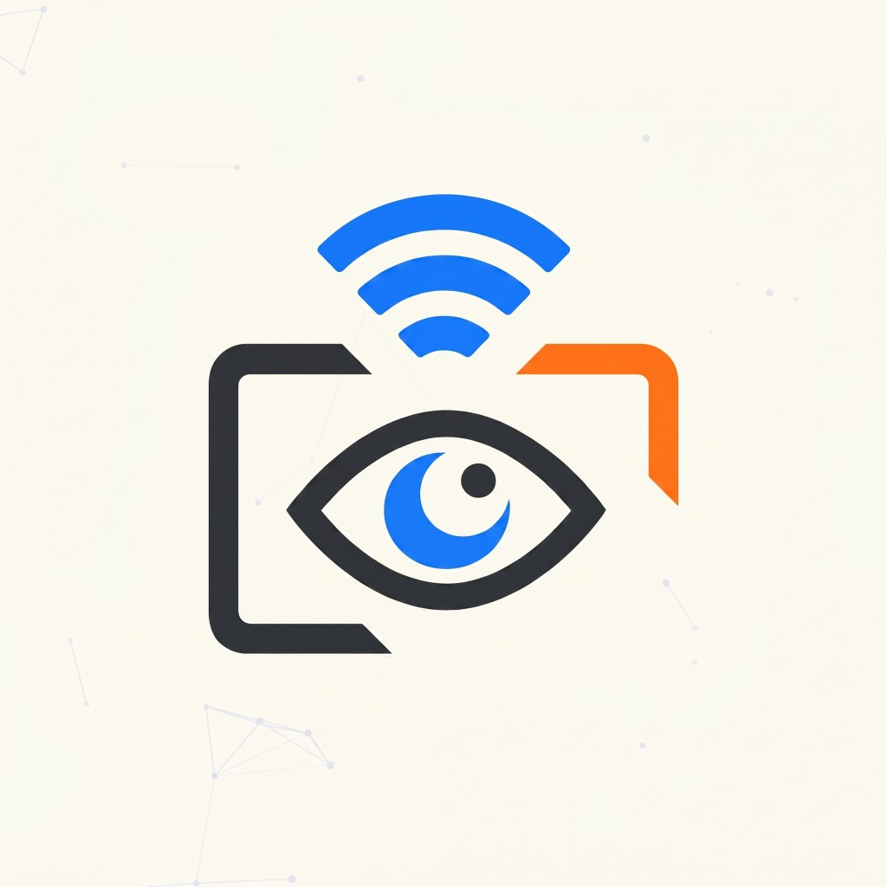

# OSHA AI - Smart Camera Analytics Dashboard

**OSHA AI** is a real-time, AI-powered camera analytics dashboard designed to monitor video streams and generate intelligent alerts based on dynamic visual triggers. Built for modern workspaces and security systems, it allows users to monitor live feeds, configure custom detection rules, and review historical events through an interactive and highly responsive interface.

## 🚀 Key Features

*   **Real-Time Dashboard:** A sleek, dark-mode optimized UI that tracks active cameras, live detections, and system health metrics.
*   **AI-Powered Detections:** Configurable rule sets (e.g., "Person near loading dock", "Vehicle unrecognized") that trigger instant logging when specific criteria are met in the camera feeds.
*   **Live Stream Integration:** Seamlessly handles multiple concurrent HLS video streams right in the browser using dynamic layouts.
*   **Google OAuth Authentication:** Secure, frictionless login flow using Supabase and Google.
*   **Interactive Notifications & Telemetry:** Real-time push alerts, detailed event timelines, and visually rich Chart.js analytics graphs tracking camera utilization over time.
*   **Responsive Architecture:** Front-end built with Vanilla JS, HTML5, and CSS3. Backend powered by Node.js, Express, and a PostgreSQL (Supabase) database for state and event management.

## 🛠️ Tech Stack

*   **Frontend:** HTML5, CSS3, Vanilla JavaScript, Chart.js, HLS.js
*   **Backend:** Node.js, Express.js
*   **Database & Auth:** Supabase (PostgreSQL), Google OAuth
*   **Real-Time:** WebSockets / Supabase Realtime Subscriptions

## 💡 About this Project

This project was built to demonstrate full-stack capabilities, particularly focusing on real-time data synchronization, secure authentication flows, and building complex, state-driven user interfaces without relying heavily on bloated frontend frameworks. 

---
*Created as a portfolio piece to showcase full-stack development, UI/UX design, and API integration skills.*

## Copyright
© 2026 Amaan Zubair Shaikh. All Rights Reserved.

This code is proprietary and may not be copied, distributed, modified, or used without explicit written permission from the owner.

